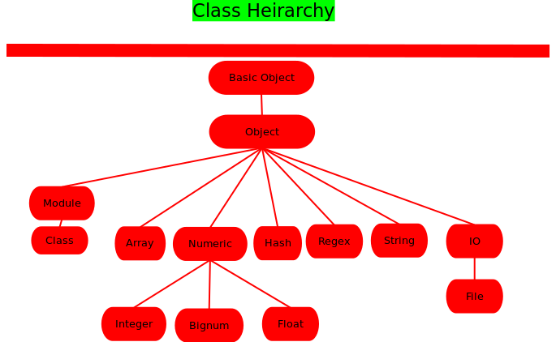

layout: true

.signature[@algogrit]

---

class: center, middle

# Ruby

Gaurav Agarwal

---
class: center, middle

## Who is this class for?

---

- Experienced software engineers

- Application developers

- Devops engineers

---
class: center, middle

## What are we going to learn?

---
class: center, middle

*Outline*

---

class: center, middle


Software Engineer & Product Developer

Principal Consultant & Founder @ https://codermana.com

ex-Tarka Labs, ex-BrowserStack, ex-ThoughtWorks

---

class: center, middle

*What we wanted*


---

class: center, middle

*What we got*


---

## As a instructor

- I promise to

  - make this class as interactive as possible

  - use as many resources as available to keep you engaged

  - ensure everyone's questions are addressed

---

## What I need from you

- Be vocal

  - Let me know if there any audio/video issues ASAP

  - Feel free to interrupt me and ask me questions

- Be punctual

- Give feedback

- Work on the exercises

- Be *on mute* unless you are speaking

---
class: center, middle

## Class Progression

---
class: center, middle


---
class: center, middle

Here you are trying to *learn* something, while here your *brain* is doing you a favor by making sure the learning doesn't stick!

---

### Some tips

- Slow down => stop & think
  - listen for the questions and answer

- Do the exercises
  - not add-ons; not optional

- There are no dumb questions!

- Drink water. Lots of it!

---

### Some tips (continued)

- Take notes
  - Try: *Repetitive Spaced Out Learning*

- Talk about it out loud

- Listen to your brain

- *Experiment!*

---
class: center, middle

### 📚 Content ` > ` 🕒 Time

---
class: center, middle

## Show of hands

*Yay's - in Chat*

---
class: center, middle

*A dynamic, open source programming language with a focus on simplicity and productivity. It has an elegant syntax that is natural to read and easy to write.*

---
class: center, middle

## Why Ruby?

.content-credits[https://www.ruby-lang.org/en/about/]

---
class: center, middle

Ruby is a *dynamically-typed*, *object-oriented*, *expressive* & *elegant* programming language.

---

### `Hello, World!`

In file, `hello.rb`:

```ruby
name = "Rubyist"

puts "Hello, #{name}!"
```

```bash
$ ruby hello.rb

Hello, Rubyist!
```

---
class: center, middle

Ruby is a language of careful balance. Its creator, Yukihiro “Matz” Matsumoto, blended parts of his favorite languages (`Perl`, `Smalltalk`, `Eiffel`, `Ada`, and `Lisp`) to form a new language that balanced functional programming with imperative programming.

---
class: center, middle

*trying to make Ruby natural, not simple*

---

- Everything is an object

- Flexible

- Blocks

- Mixins

- Visual Appearance

---
class: center, middle


---
class: center, middle

Monkey Patching (Flexibility)

---
class: center, middle

Ruby *closures* resemble *Lisp* functions

---
class: center, middle

Ruby features single inheritance only

---
class: center, middle

Ruby often uses very limited punctuation and usually prefers English keywords, some punctuation is used to decorate Ruby

---

- Ruby has exception handling features, like Java or Python, to make it easy to handle errors.

- Ruby features a true mark-and-sweep garbage collector for all Ruby objects. No need to maintain reference counts in extension libraries. As Matz says, “This is better for your health.”

- Writing C extensions in Ruby is easier than in Perl or Python, with a very elegant API for calling Ruby from C. This includes calls for embedding Ruby in software, for use as a scripting language. A SWIG interface is also available.

---

- Ruby can load extension libraries dynamically if an OS allows.

- Ruby features OS independent threading. Thus, for all platforms on which Ruby runs, you also have multithreading, regardless of if the OS supports it or not, even on MS-DOS!

- Ruby is highly portable: it is developed mostly on GNU/Linux, but works on many types of UNIX, macOS, Windows, DOS, BeOS, OS/2, etc.

---
class: center, middle

## Installation & Setup

---
class: center, middle

## Working with `rbenv`

---
class: center, middle

## Declaring variables & functions

---

### Naming conventions

- Class & Module names are `UpperCamelCase` or `PascalCase`.

- Methods and variables are `snake_case`.

- Constants are `SCREAMING_SNAKE_CASE` or `Upper_Snake_Case`.

---
class: center, middle

## Variable Scopes

---
class: center, middle

## Data Types

---
class: center, middle



.content-credits[http://rubylearning.com/satishtalim/numbers_in_ruby.html]

---
class: center, middle

### Strings vs Symbols

---

### String methods

- `blank`

- `nil`

- `empty`

---
class: center, middle

Dealing with `nil` values: `&&`, `||`

---
class: center, middle

## Data Structures

---
class: center, middle

### Arrays

---
class: center, middle

### Sets

---
class: center, middle

### Class

---
class: center, middle

### Hashes

---
class: center, middle

Using symbols for keys

---
class: center, middle

Destructuring (`*`)

---
class: center, middle

Destructuring hashes in `Ruby 3` (rightward assignment)

.content-credits[https://www.ruby3.dev/ruby-3-fundamentals/2021/01/06/everything-you-need-to-know-about-destructuring-in-ruby-3/]

---
class: center, middle

## Flow Control

---
class: center, middle

`if` & `unless`

---
class: center, middle

`for`

---
class: center, middle

`while` & `until`

---
class: center, middle

`do...while`

---
class: center, middle

`case`

---
class: center, middle

### Pattern matching with `case`

.content-credits[https://docs.ruby-lang.org/en/3.0.0/doc/syntax/pattern_matching_rdoc.html]

---

### Going FP

- `map`

- `reduce`

- `filter`

- ...

---
class: center, middle

## Object-oriented

---

### Class attributes

`attr_accessor` vs `attr_reader` & `attr_writer`

---
class: center, middle

`initialize`

---
class: center, middle

### Class Variables

---
class: center, middle

`@` vs `@@`

---
class: center, middle

## Pass by value

---

- Methods with a `=` suffix are for setters.

- Methods with a `?` suffix will return a boolean.

- Methods with a `!` suffix mean one of two things: either the method operates destructively in some fashion, or it will raise and exception instead of failing.

- In documentation, `::method_name` denotes a class method, while `#method_name` denotes a instance method.

---
class: center, middle

### Inheritance

---
class: center, middle

`class` & `superclass`

---
class: center, middle

### Duck Typing

---
class: center, middle

`responds_to?` vs `instance_of?`

---
class: center, middle

`try` vs `try!` vs `&.`

---
class: center, middle

## Higher order functions

---
class: center, middle

`blocks` (yield)

---
class: center, middle

`procs` (call)

---
class: center, middle

Lambdas

---
class: center, middle

## Require

---
class: center, middle

`require`, `require_all`, `require_relative`

---
class: center, middle

### Working with third-party libraries (gems)

---
class: center, middle

### Managing third-party dependencies (Bundler)

---
class: center, middle

*Optional*: Writing your own gem

---
class: center, middle

## Modules

---
class: center, middle

### For Namespacing

---
class: center, middle

### As Mixins

---
class: center, middle

[`Enumerable`](https://ruby-doc.org/core-3.0.2/Enumerable.html)

---
class: center, middle

[`Comparable`](https://ruby-doc.org/core-3.0.2/Comparable.html)

---
class: center, middle

## Monkey Patching

---
class: center, middle

### Operator Overloading

---
class: center, middle

## Metaprogramming

---
class: center, middle

`define_method`

---
class: center, middle

`method_missing` & `respond_to?`

---
class: center, middle

`class_eval` vs `instance_eval`

---
class: center, middle

## Building & designing DSLs

---
class: center, middle

## Introducing `Rake`

---
class: center, middle

## Debugging

---

- Figuring type

- Locating methods

---
class: center, middle

`pry`

---
class: center, middle

## Testing

---
class: center, middle

`Test::Unit` vs `rspec`

---
class: center, middle

## Error Handling

---
class: center, middle

## Working with files

---

- `json`

- `csv`

---
class: center, middle

## Ruby for scripting

---

- Built-in constants

- Working with environment

---
class: center, middle

## Working with regular expressions

---
class: center, middle

## Working with `Date` and `Time`

---
class: center, middle

Code
https://github.com/AgarwalConsulting/ruby_training

Slides
http://ruby.slides.agarwalconsulting.io/
